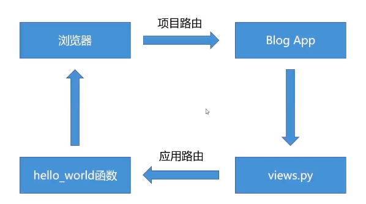
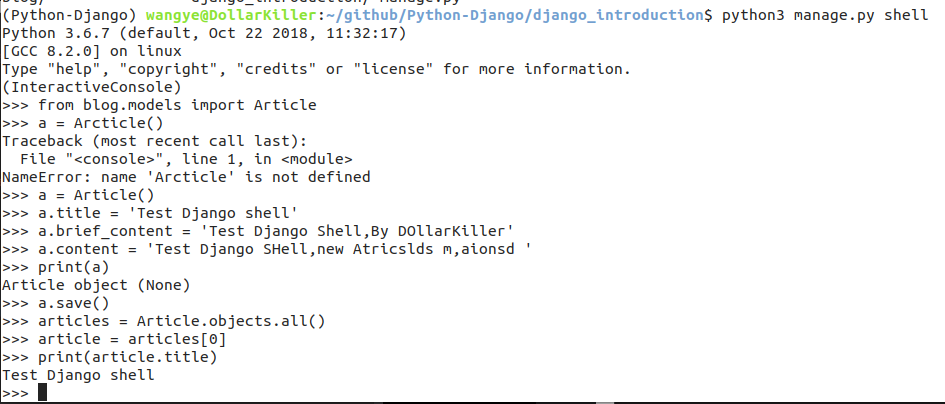

# Python Django

### pipenv
- `pipenv install`
- `pipenv shell` 
- `pipenv install django==20`
- `django-admin`

### Django 初体验
- 基本命令
    - `django-admin startproject` 创建一个django项目
    - `django-admin startapp` 创建一个django应用
    - `django-admin check` 校验项目完整性
    - `django-admin runserver` 本地简易运行Django项目
    - `django-admin shell` 进入django Python shell
    - `django-admin test` 单元测试
- 数据库相关
    - `makemigrations` 创建模型变更的迁移文件
    - `migrate` 执行一个命令创建
    - `dumpdata` 把数据库导出到文件
    - `loaddata` 把文件数据导入到数据库
- 演示
    - 创建一个项目
        - `django-admin startproject django_introduction`
    - 目录介绍
        - `manage.py` 项目管理文件
            - 下级目录
                - `settings.py` 配置文件
                - `urls.py` 路由文件
                - `wsgi.py` wsgi是应用需要文件内容
    - 运行
        - `python manage.py runserver`
- 一个Django项目包含一组配置和若干个Django应用
    - 创建一个应用
        - `python manage.py startapp appName`
    - Django 应用目录介绍
        - `views.py` 视图处理的地方
        - `models.py` 定义应用模型的地方
        - `admin.py` 定义Admin 模块管理对象的地方
        - `apps.py` 声明应用的地方
        - `tests.py` 编写应用测试用例的地方
        - `urls.py` (自行创建) 管理应用路由的地方
- Django HelloWorld
    - Django 视图  views.py
      ```
        from django.shortcuts import render
        from django.http import HttpResponse
        # Create your views here.

        def hello_world(request):
            return HttpResponse('Hello World')
      ```
    - Django 路由   touch urls.py
        ```
        from django.urls import path,include

        import blog.views

        urlpatterns = [
            path('hello_world',blog.views.hello_world)
        ]
        ```  
    - 去项目路由登记
        ```
        from django.contrib import admin
        from django.urls import path,include

        urlpatterns = [
            path('admin/', admin.site.urls),
            path('blog/',include('blog.urls'))
        ]
        ```
    - 去项目seetings 注册
        ```
        INSTALLED_APPS = [
            'django.contrib.admin',
            'django.contrib.auth',
            'django.contrib.contenttypes',
            'django.contrib.sessions',
            'django.contrib.messages',
            'django.contrib.staticfiles',
            
            'blog.apps.BlogConfig'
        ]
        ```
    

### Django Model
- 数据库配置 > setting > DATABASES
- 设计模块模型
  - 模型层定义字段
    - 数字类型: IntegerField
    - 文本类型: TextField
    - 日期模型: DateTimeField
    - 自增ID: AutoField
    - 主键定义: primary_key 属性
- 数据库迁移
  - 创建迁移文件 `python manage.py makemigrations`
  - 迁移 `python manage.py migrate`

- Django Shell
  - 临时性操作
  - 小范围的Debug
  - 方便 开发 调试 规范
  - `python manage.py shell`
    